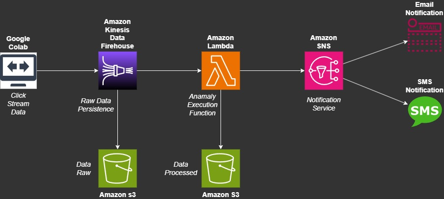

# AWS-ClickStreamingEvent
## Steps
- [Introduction](##Introduction)
- [Setup](##Setup)
- [Architecture Diagram](##Architecture-Diagram)

## Introduction
This guide will assist in configuring the laboratory environment for real-time clickstream anomaly detection, emphasizing its practical application.

## Setup
#### AWS KINESIS DATA FIREHOUSE - SETTING:

  Transform and convert records
  -----------------------------
- Data transformation -> On
- Buffer size -> 1 MiB
- Buffer interval -> 60 seconds
- Lambda function -> ClickStreamingLambda
- Lambda function version -> $LATEST
- Runtime -> python3.7
- Timeout -> 1 minute
- All default configuration

Destination settings
--------------------
S3 bucket -> YOUR DATA RAW BUCKET
S3 bucket prefix -> YOUR PREFIX BUCKET
Buffer size -> 5 MiB
Buffer interval -> 300 seconds
All default configuration

Backup settings
---------------
All default configuration

Server-side encrytion
---------------------
All default configuration

Destination error logs
----------------------
Amazon CloudWatch error logging -> Enabled

Service access
--------------
IAM role -> YOUR IAM ROLE

Tags
----
All default configuration

## Architecture Diagram

