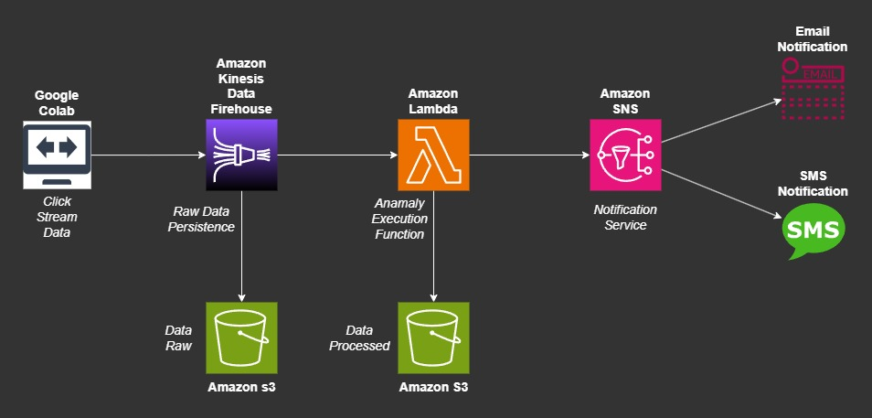

# AWS-ClickStreamingEvent
## Steps
- [Introduction](##Introduction)
- [Setup](##Setup)
- [Architecture-Diagram](##Architecture-Diagram)

## Introduction
This guide will assist in configuring the laboratory environment for real-time clickstream anomaly detection, emphasizing its practical application.

- Two Amazon Simple Storage Service (Amazon S3) buckets: You will use these buckets to persist raw and processed data.
- One AWS Lambda function: This Lambda function will be triggered once an anomaly has been detected.
- Amazon Simple Notification Service (Amazon SNS) topic with an email and phone number subscribed to it: The Lambda function will publish to this topic once an anomaly has been detected.

## Setup
###  AWS KINESIS DATA FIREHOUSE:

#### Transform and convert records
        - Data transformation -> On
        - Buffer size -> 1 MiB
        - Buffer interval -> 60 seconds
        - Lambda function -> ClickStreamingLambda
        - Lambda function version -> $LATEST
        - Runtime -> python3.7
        - Timeout -> 1 minute
        - All default configuration

#### Destination settings
        - S3 bucket -> YOUR DATA RAW BUCKET
        - S3 bucket prefix -> YOUR PREFIX BUCKET
        - Buffer size -> 5 MiB
        - Buffer interval -> 300 seconds
        - All default configuration

#### Backup settings
        - All default configuration

#### Server-side encrytion
        - All default configuration

#### Destination error logs
        - Amazon CloudWatch error logging -> Enabled

#### Service access
        - IAM role -> YOUR IAM ROLE

#### Tags
        - All default configuration

###  AWS LAMBDA:

#### General configuration
        - Timeout -> 1 min 0 sec
        - Memory -> 128 MB
        - SnapStart -> None
        - Ephemeral storage -> 512 MB

#### Runtime settings
        - Runtime -> Python 3.7
        - Handler -> lambda_function.lambda_handler
        - Architecture -> x86_64

#### Execution role
        - logs:CreateLogGroup -> YOUR ARN  
        - logs:CreateLogStream -> YOUR ARN 
        - logs:PutLogEvents -> YOUR ARN 
 
#### Layers
        - Merge order -> 1
        - Name -> AWSSDKPandas-Python37
        - Layer version -> 5
        - Compatible runtimes -> python3.7
        - Compatible architectures -> x86_64
        - Version ARN -> YOUR ARN

### AWS SNS:

#### Details
        - Name -> ClickStreamingTopic
        - Display name -> ClickStreamingTopic
        - ARN -> YOUR ARN
        - Type -> Standard
        - Topic owner -> YOUR TOPIC OWNER

#### Subscriptions
        - ID -> YOUR NUMBER
        - PROTOCOL -> SMS
        - ID -> YOUR EMAIL
        - PROTOCOL -> EMAIL

### AWS S3:

#### Create your own raw and processed data bucket

## Architecture-Diagram

